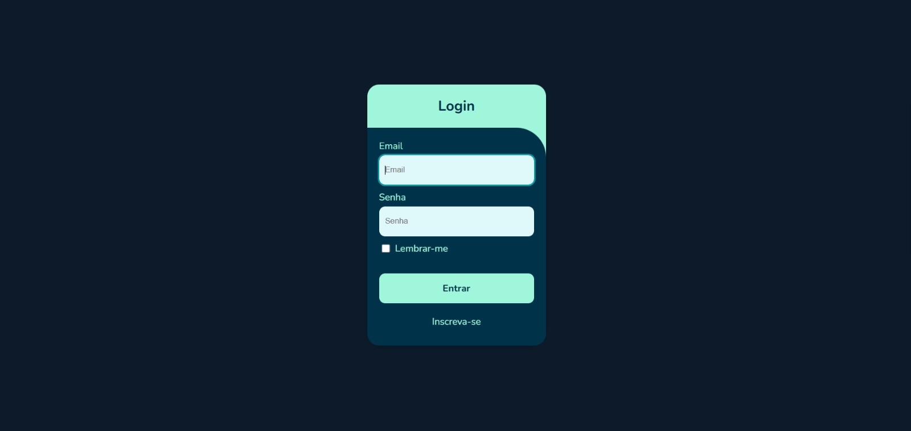
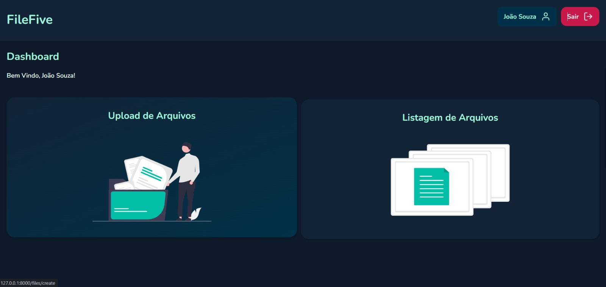

# Dashboard do Projeto Laravel




## Sobre o Projeto

Este é um projeto desenvolvido utilizando o framework Laravel, com o objetivo de criar uma interface intuitiva para gerenciar dados de forma eficiente. A tela de Dashboard oferece uma visão geral das principais métricas e informações do sistema.

Um dos grandes desafios deste projeto foi trabalhar com arquivos e o gerenciamento da arquitetura, permitindo que cada usuário possa aprovar ou reprovar arquivos de forma personalizada. Essa funcionalidade foi implementada com foco na organização e segurança dos dados, garantindo uma experiência robusta e confiável.


## Funcionalidades Principais

- **Interface Intuitiva:** Design limpo e fácil de navegar.
- **Gerenciamento de Dados:** Ferramentas para organizar e visualizar arquivos e informações importantes.
- **Responsividade:** Compatível com diferentes dispositivos.

## Tecnologias Utilizadas

- [Laravel](https://laravel.com/) como framework principal.
- HTML, CSS e JavaScript para o front-end.
- MySQL para banco de dados.

## Pré-requisitos

Certifique-se de ter as seguintes ferramentas instaladas:

- PHP >= 8.0
- Composer
- MySQL

## Como Executar o Projeto

1. Clone o repositório:
   ```bash
   git clone https://github.com/ricardo006/FilesFive.git
   ```

2. Instale as dependências:
   ```bash
   composer install
   ```

3. Configure o arquivo `.env` com as informações do banco de dados.

4. Execute as migrações:
   ```bash
   php artisan migrate
   ```

5. Inicie o servidor local:
   ```bash
   php artisan serve
   ```

6. Acesse o projeto em `http://localhost:8000`.

## Autor

Projeto desenvolvido por [Ricardo Oliveira](https://github.com/ricardo006).

---

Esperamos que você aproveite o projeto! Caso tenha dúvidas ou sugestões, fique à vontade para abrir uma issue no repositório.

